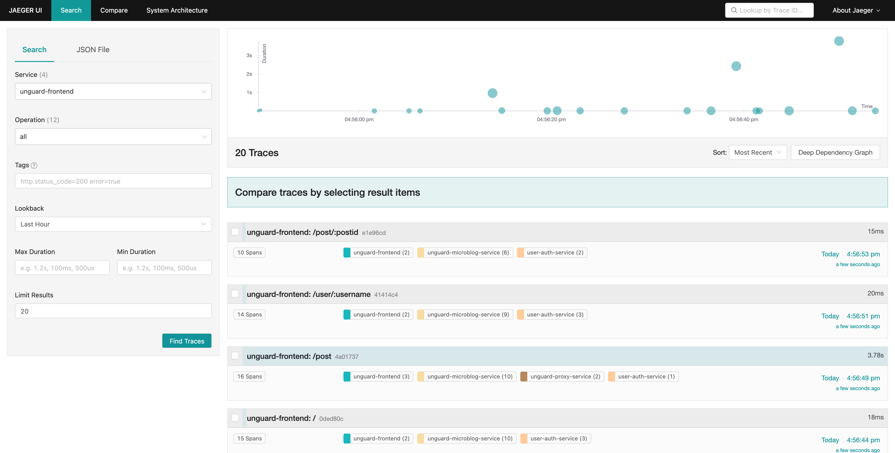

# Tracing

The services are different jaeger-client libraries to support tracing using Jaeger:

> A distributed tracing platform created by Uber Technologies and donated to Cloud Native Computing Foundation.

## Enable tracing in services

By using the default Skaffold deployment tracing would be disabled for all services. To enable it, the corresponding
environment variables has to be set by e.g. specifying the `tracing` Skaffold profile during deployment:

```sh
skaffold run -p tracing
```

If tracing is enabled, it is assumed that a Jaeger instance is running.

## ⚙️ Jaeger Installation

Use the `jaeger` profile when calling Skaffold to deploy the scalable Jaeger stack with an Elasticsearch backend.
This is not recommended for local development, due to the high memory / CPU demand.

```sh
skaffold run -p jaeger
```

For local development, the jaeger all-in-one deployment can be used as a drop-in replacement for the more production ready
Jaeger stack. This can be deployed using the `jaeger-dev` Skaffold profile.

```sh
skaffold run -p jaeger-dev
```

To deploy Jaegen and enable tracing in the services both profiled has to be sepcified:

```sh
skaffold run -p jaeger,tracing
## or
skaffold run -p jaeger-dev,tracing
```

## 🖥️ Usage

1. Port-forward the Jaeger UI

    ```sh
    kubectl port-forward -n unguard service/jaeger-query 16686:16686
    ```

2. Open [localhost:16686](localhost:16686)

    
